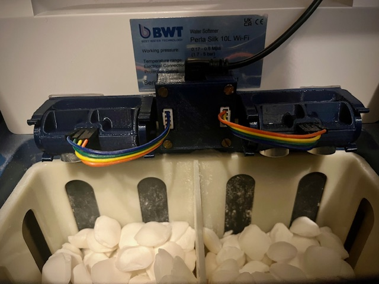
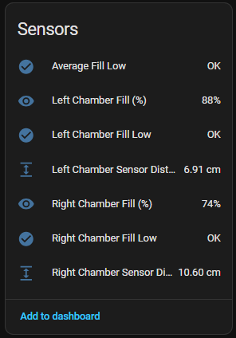
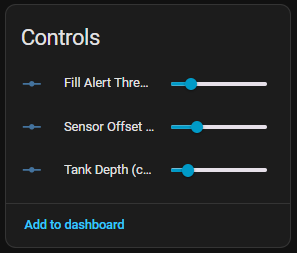

# Salt Owl

**Salt Owl** is an ESPHome-based tool designed to accurately measure and report the fill levels of brine tanks in a water softener system. Using ultrasonic distance sensors, the system calculates the salt level in each chamber and reports it to Home Assistant, enabling automated alerts when the tanks are running low.

This solution is ideal for anyone looking to monitor water softener salt levels remotely and avoid unexpected outages due to empty brine pans.

Features include:
- Dual-chamber support (left/right tanks)
- Configurable tank depth and sensor offsets
- Home Assistant integration for real-time monitoring and alerts
- Low salt level warnings with custom thresholds
- Simple setup using ESP8266 and ESPHome


## Example Setup



## Getting Started

To get up and running with the Brine Pan Level Monitor, follow the two-step process below:

### 1. Build the Hardware

This step covers the physical assembly of the device — including wiring the sensors, flashing the firmware, and mounting the components.

📄 See the full build guide: [`docs/build.md`](docs/build.md)

### 2. Configure the Device

Once the device is powered and connected, you'll need to set up key parameters such as tank depth, sensor offset, and alert thresholds. This is done via Home Assistant after the device is discovered.

⚙️ See the configuration guide: [`docs/setup-saltowl.md`](docs/setup-saltowl.md)

> [!Note]
No prior expeirence is required, but both guides assume basic familiarity with 3D Printing and ESPHome /Home Assistant.   For a brief walkthrough of setting up a new ESP device in ESPHome, see the guide  [`docs/ha-add-esp.md`](docs/ha-add-esp.md)


## Home Assistant Integration

Once the Brine Pan Level Monitor is connected and discovered by Home Assistant (via the native ESPHome integration), it will expose a number of sensors and controls that can be used in dashboards, automations, and alerts.

### 📡 Sensors (Read-Only Entities)

The default sensors include:

- **Left Chamber Fill (%)**
- **Right Chamber Fill (%)**
- **Average Fill Level**
- **Low Fill Alerts** (for each chamber and overall)
- **Tank Depth Adjustment**
- **Sensor Offset Calibration**
- **Low Fill Threshold Setting**

These values are updated hourly by default and reflect the current saltwater level in each tank, calculated using ultrasonic distance readings.



### 🛠️ Controls (via Number Entities)

The following configuration parameters are exposed as number inputs:

- **Sensor Offset (cm)**: Adjusts for sensor height above water line

- **Tank Depth (cm)**: Total depth of the brine tank

- **Fill Alert Threshold (%)**: Controls when “Low Fill” warnings are triggered

These can be adjusted live via the Lovelace interface, and changes are applied immediately without reflashing the device.




### 🧭 Lovelace Dashboard

You can build a simple Lovelace card (e.g. vertical stack, gauge, or entities) to display:

```yaml
type: vertical-stack
cards:
  - type: gauge
    entity: sensor.left_chamber_fill
    name: Left Tank
    min: 0
    max: 100
  - type: gauge
    entity: sensor.right_chamber_fill
    name: Right Tank
    min: 0
    max: 100
  - type: entities
    entities:
      - binary_sensor.left_chamber_fill_low
      - binary_sensor.right_chamber_fill_low
      - binary_sensor.average_fill_low
      - number.tank_depth
      - number.sensor_offset
      - number.fill_alert_threshold

## Change Log

- v1.0: Initial Public Release


## License

Copyright (c) 2025 SolutionHacker

This work is licensed under the Creative Commons Attribution-NonCommercial 4.0 International License.

You are free to:
- Share — copy and redistribute the material in any medium or format.
- Adapt — remix, transform, and build upon the material.

Under the following terms:
- Attribution — You must give appropriate credit, provide a link to the license, and indicate if changes were made.
- NonCommercial — You may not use the material for commercial purposes.
- No additional restrictions — You may not apply legal terms or technological measures that legally restrict others from doing anything the license permits.

Full License Text:
https://creativecommons.org/licenses/by-nc/4.0/

