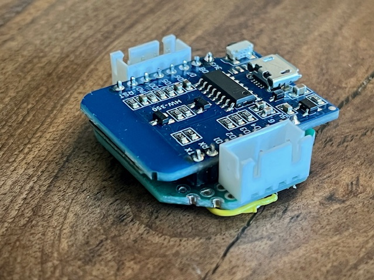

# SaltOwl Build Guide

## Materials

You will need to 3D Print (see /case directory)
 * 1 Base & 1 Lid
 * 2 Backs, 2 Fronts & 4 Rings
 * 2 Cradles

In addition to 3D Printing the STL files, you will need:

 * 1 * ESP8266 (You could use other ESP devices, but the form factor of the Base /Lid and pinout will be different)
 * 2 * HC-SR04 Ultrasonic Sensors
 * 2 * 4pin JST to Dupont Cables (you may need to make these up yourselves)
 * 2 * 4pin JST Sockets
 * Small piece of Veroboard (Approx 10 * 14 holes for ESP8266)
 * Blob of superglue to connect the base and Ultrasonic cradles
 * Double Sided Tape to stick SaltOwl to the Water Softener
 
 > [!TIP] 
 Witin the /case directory, two different cradles are supplied.  The original (and thinner) is Cradle 1, the reworked (and slightly fatter) version is Cradle 2.    Printing these horiziontally make them extremely fragile and, frankly ineffective!   I would strongly recommended printing these standing vertially and using support to ensure the best, most durable, build quality.

## Circuit Diagram
For Reference, here is the circuit diagram for the build

## Build
The base and cradles are affixed with glue, either side of the ESP Case:

> [!NOTE]
The upper and lower sides of the cradles are not symetric, so be sure to stick them the same way around, whichever way you choose...!

The HC-SR04 sits in the Front, the back is pushed in place and each end has a ring over it.  This then pushes into the cradle and allows it to angle as necessary.

To give the 4Pin JST Sockets some strength, I recommend mounting these on a small piece of veroboard.   While not essential (and a bit of a headache then finding the JST -> Dupont cables...) here I cut this to size and mounted the ESP with the straight through / single pin SIL connectors that came with the ESP itself.   Soldering the pins, and subsequently, wires in place.   

  

If all goes well, this is the final build should look...

> [!NOTE] 
The 3D Print Files are released under the terms granted by their author's licence and remains their original work.   Though I use it here, I claim no originality

HC-SR04 Casing + Angle Adjustable Cradle
https://www.thingiverse.com/thing:1799012
by SavageRodent is licensed under the Creative Commons - Attribution license.

Remix HC-SR04 Casing Cradle
https://www.thingiverse.com/thing:3498480
by Crystallica is licensed under the Creative Commons - Attribution license.

> [!IMPORTANT]
While *all* included the 3D Print files are licenced under the Creative Commons - Attribution license, the code and other portions of SaltOwl is licenced under the Creative Commons Attribution-NonCommercial 4.0 International Licecne.   See https://creativecommons.org/licenses/by-nc/4.0/ for more detail.
