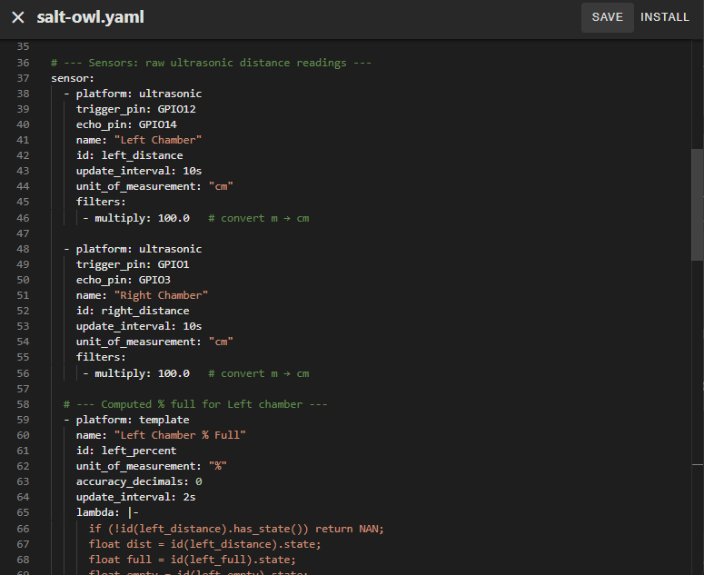

# ESP8266 Configuring and Setup

### 6. Configure Wi-Fi and OTA
   After installation, ESPHome Web will prompt you to enter your Wi-Fi credentials:

* Wi-Fi SSID
* Wi-Fi Password

(Optional) OTA password — used for secure over-the-air updates later

Click Next or Install once details are entered.

### 7. Install Your Configuration
   Now you’ll upload the custom SaltOwl ESPHome configuration (YAML).
   Remember to edit it and add your own Wifi Settings and IP Addresses in!
   

Click Install and wait for the flashing to complete.

> [!Note]
Once complete, the device will reboot and connect to your Wi-Fi network.

### 8. Add the Device to Home Assistant
   With your ESP device now on the network, go to your Home Assistant Dashboard.

* Navigate to Settings > Devices \& Services
* Under Discovered, you should see your new ESPHome device

Click Configure and follow the prompts

> [!Note]
If you set an OTA password earlier, you'll be prompted to enter it here.

### 9. Done! 🎉
   Your ESP device is now fully integrated into Home Assistant. You can:

* Monitor sensor readings
* Control outputs (e.g., relays, LEDs)
* Update firmware via OTA directly from Home Assistant

## Tips \& Troubleshooting
If the device doesn’t show up in Home Assistant, make sure it’s powered on and connected to the same network.
Use the ESPHome Add-on in Home Assistant for easier long-term management of your devices.

> [!Important]
***Always keep a backup of your YAML configuration files.***

