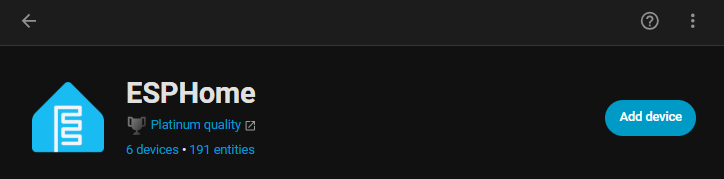
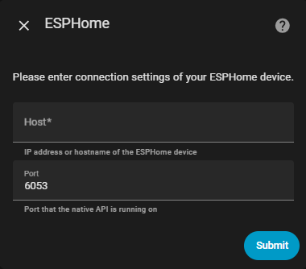

# ESP8266: Configuring and Setup

### 1. Configure Base ESP Settings
After installation with ESPHome Web, Salt Owl should be configured and displayed as below.  


To setup / edit the code run by the ESP, click Edit
Once clicked, you will see SaltOwl's initial or curernt code.  This will be simular to below, but key sections will need adding or modifying as discussed:

```yaml

sp8266:
  board: esp01_1m

# Enable logging
logger:

# Enable Home Assistant API
api:
  encryption:
    key: ""    # <- Add your Encryption Key here

wifi:
  ssid: !secret wifi_ssid
  password: !secret wifi_password
  manual_ip:                             # <- If you want a static IP, leave manual_ip 
   static_ip: 192.168.11.166             #    (and amend value pairs below to 'fit' your netowrk) 
   gateway: 192.168.11.1                 # Having a static IP is generally recommended!
   subnet: 255.255.255.0

ota:
  - platform: esphome
    password: ""                         # <- If you set a password during the setup process,
                                         # it will be listed here

  # Enable fallback hotspot (captive portal) in case wifi connection fails
  ap:
    ssid: "Salt-Owl Fallback Hotspot"    #  <- If the ESP Device cannot connecto to the configured Wifi, 
                                         #     you will be able to conenct to it via the Fallback Hotspot
    password: "zWMStNT3PBAV"             #  <- With this password

captive_portal:


```

With the base setup complete, add the the remainder of the script below the captive_portal: Line

You will find full code in [../salt-owl.yaml](../salt-owl.yaml)


Once Copied, Edited & Pasted, Click Install to compile and if succsesful, upload the conpiled code to the ESP

> [!Note]
Once complete, the device will reboot and connect to your Wi-Fi network, and the logs will show relevant output.


### 2. Add the Device to Home Assistant
   With your ESP device now on the network, go to your Home Assistant Dashboard.

* Navigate to Settings > Devices \& Services
* Under Discovered, you should see your new ESPHome device

If SaltOwl does not appear there, you can manually install it.   In HomeAssistant, go to Settings -> Devicces /& Services -> ESPHome and Select Add Devuce



Here you will need to add the Host IP Address (as set in salt_owl.yaml) 



and click Submit


### 3. Done! 🎉
   Your ESP device is now fully integrated into Home Assistant. You can:

* Monitor sensor readings
* Control outputs (e.g., relays, LEDs)
* Update firmware via OTA directly from Home Assistant


## Tips \& Troubleshooting
If the device doesn’t show up in Home Assistant, make sure it’s powered on and connected to the same network.
Use the ESPHome Add-on in Home Assistant for easier long-term management of your devices.


> [!Important]
***Always keep a backup of your YAML configuration files.***


