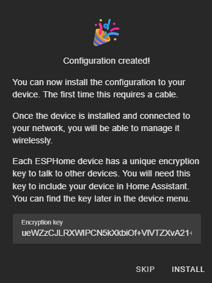

# Home Assistant Setup

If you don't know how to setup an ESP device in Home Assistant, you're in the right place.   I won't go into how to setup ESPBuilder (there are plenty of other guides for this, but once that is available, here is how to setup SaltOwl

## Prerequisites

Before you begin, make sure you have:

* A compatible ESP device (ESP8266, ESP32, etc.)
* A USB cable to connect the device to your computer (Pro Tip: Be careful to have on that caters for data, and not just power, as this may trip you up for far too long...!)
* Home Assistant - already set up
* Your Wi-Fi network name (SSID) and password
* Google Chrome or Microsoft Edge (required for web flashing)

## Setup

### 1. Open ESPHome Builder
   From within Home Assistant, select ESPHome Builder from the left hand Menu in your browser.
   This tool allows you to compile and flash ESPHome firmware directly from the browser — no additional software needed.
   WIth ESPHome Builder selected, you should be presented with a screen _like_ this

### 2. Setup basic configuration
Once you add a new ESP degvice, you will be presented with the following screens.  

 | 
 |
 |

Here you will have an opportunity to copy your encryption key.   While essential to keep private, there is no need to write this down, as you will have access to it later.

   
### 3. Connect Your ESP Device
   Plug your ESP device into your computer via USB.
   Click the "Continue" button on the ESPHome Web page.

> [!Note]
Your browser may ask for permission to access the USB device — allow it.

### 4. Select Your Device
   Choose the correct serial port/device from the list and click Connect again.
   Once connected, the tool will show the status of the device.

> [!Note]
You may need to install a serial driver to find the relevant serial port and the ESP.  Installing these drivers are not unique to SaltOwl and guides are freely available to achieve this.

When complete, download the project and click Open ESPHome Web

 |

### 5. Install ESPHome Firmware
   This will likely be the first time using the ESP device, so click "Install ESPHome" or "Install ESPHome on this device."
   This installs the ESPHome bootloader and prepares the device for configuration.

> [!Note]
This process may take a few minutes. Wait for the confirmation message once complete.

 |

 |

### 6. Configure Wi-Fi and OTA
   After installation, ESPHome Web will prompt you to enter your Wi-Fi credentials:

* Wi-Fi SSID
* Wi-Fi Password

(Optional) OTA password — used for secure over-the-air updates later

Click Next or Install once details are entered.

### 7. Install Your Configuration
   Now you’ll upload the custom SaltOwl ESPHome configuration (YAML).
   Remember to edit it and add your own Wifi Settings and IP Addresses in!
   

Click Install and wait for the flashing to complete.

> [!Note]
Once complete, the device will reboot and connect to your Wi-Fi network.

### 8. Add the Device to Home Assistant
   With your ESP device now on the network, go to your Home Assistant Dashboard.

* Navigate to Settings > Devices \& Services
* Under Discovered, you should see your new ESPHome device

Click Configure and follow the prompts

> [!Note]
If you set an OTA password earlier, you'll be prompted to enter it here.

### 9. Done! 🎉
   Your ESP device is now fully integrated into Home Assistant. You can:

* Monitor sensor readings
* Control outputs (e.g., relays, LEDs)
* Update firmware via OTA directly from Home Assistant

## Tips \& Troubleshooting
If the device doesn’t show up in Home Assistant, make sure it’s powered on and connected to the same network.
Use the ESPHome Add-on in Home Assistant for easier long-term management of your devices.

> [!Important]
***Always keep a backup of your YAML configuration files.***

